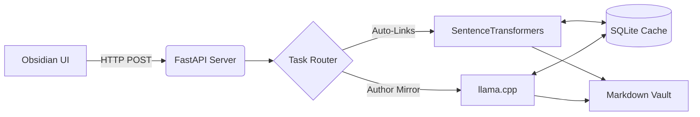

# PKM AI

Local, private AI orchestration for Personal Knowledge Management (PKM). 

This project bridges a local Python backend with an Obsidian frontend, allowing you to enrich your markdown vault using local Large Language Models (LLMs) and vector embeddings—entirely offline and without subscription APIs.

## Features

- **Semantic Auto-Links:** Scans your vault, computes embeddings for each note using `sentence-transformers`, and automatically injects contextual wikilinks to conceptually similar notes.
- **Author Mirror (Thesis / Antithesis):** Uses a local LLM (via `llama.cpp`) to read a note and generate a dialectical response, proposing one real-world author who supports your idea and another who opposes it, complete with synthesized arguments.
- **Smart Caching:** Uses SQLite to cache document hashes and high-dimensional vectors, ensuring that AI models only process notes that have actually been modified.
- **Obsidian Integration:** Includes a custom TypeScript plugin that adds UI buttons inside Obsidian to trigger background Python generation via a local FastAPI server.

## Architecture



## Prerequisites

- **Python 3.10+** (Package management via [uv](https://github.com/astral-sh/uv) recommended)
- **Node.js & npm** (For compiling the Obsidian plugin)
- A local `.gguf` LLM (e.g., Llama 3, Mistral) downloaded to your machine.

## Installation

**1. Backend (Python Server)**

Clone the repository and install the backend as an editable package using `uv`:

```bash
git clone https://github.com/maeldepreville/pkmai.git
cd pkmai
uv sync
```

Copy the example configuration file and update the paths to point to your vault and local LLM:

```bash
cp config.example.yaml config.yaml
```

**2. Frontend (Obsidian Plugin)**

Navigate to your Obsidian vault's plugin directory and build the bridge:

```bash
cd /path/to/your/vault/.obsidian/plugins/pkmai-bridge
npm install
npm run build
```

Once built, open Obsidian > Settings > Community Plugins and enable PKM AI Bridge.

## Usage

### The CLI
The project includes a fully featured Typer CLI. You can run tasks manually from the terminal:
```bash
pkmai info          # View current system configuration
pkmai links         # Run the Auto-Links pipeline manually
pkmai mirror        # Run the Author Mirror pipeline manually
pkmai mirror -f     # Force regenerate mirrors, bypassing the cache
```

### The API Server & Obsidian
To use the Obsidian UI buttons, the background server must be running:
```bash
pkmai serve
```
With the server listening on `localhost:8000`, clicking the link or user icons in the Obsidian sidebar will automatically trigger the respective background processes.

## Technical Stack

- **AI/ML:** `llama-cpp-python`, `sentence-transformers`, `numpy`
- **Backend:** `FastAPI`, `uvicorn`, `typer`, `pydantic`
- **Data:** Standard `sqlite3` (Vector binary serialization)
- **Frontend:** TypeScript, Obsidian API