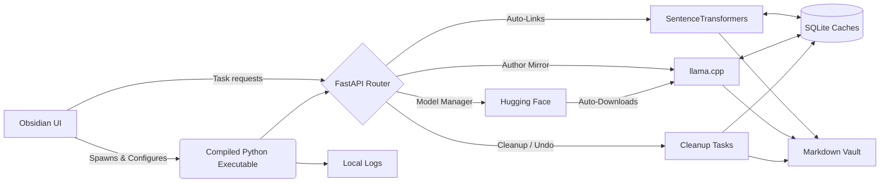

# PKM AI

Local, private AI orchestration for Personal Knowledge Management (PKM). 

This project bridges a local Python backend with an Obsidian frontend, allowing you to enrich your markdown vault using local Large Language Models (LLMs) and vector embeddings; entirely offline and without subscription APIs.


## Features

- **Zero-Setup Standalone App:** The backend is compiled into a standalone executable for Windows and macOS. No Python environments, no Node.js, and no terminal commands are required for end-users.
- **Semantic Auto-Links:** Scans your vault, computes embeddings for each note using `sentence-transformers`, and automatically injects contextual wikilinks to conceptually similar notes.
- **Author Mirror (Thesis / Antithesis):** Uses a local LLM (via `llama.cpp`) to read a note and generate a dialectical reflection, proposing one real-world author who supports the idea and another who challenges it. Generated notes can be written in English, French, or a custom language.
- **Zero-Friction AI (Auto-Download):** No need to hunt for models. The backend will automatically download and cache a highly efficient, lightweight LLM (Qwen3.5-2B) from Hugging Face on its first run. Power users can easily toggle to use their own local `.gguf` files.
- **Obsidian Native Configuration:** Say goodbye to editing YAML files. The plugin features a comprehensive native settings menu inside Obsidian to control model paths, similarity thresholds, and ignored directories.
- **Live Status Polling:** Features a dynamic UI progress tracker in the Obsidian status bar so you always know what the background engine is processing.
- **Smart Caching:** Uses SQLite to cache document hashes and high-dimensional vectors, ensuring that AI models only process notes that have actually been modified.
- **Undo / Cleanup Actions:** Each major task can be reverted from the Obsidian settings panel. Auto-Links cleanup removes generated related-note sections and clears the embedding cache. Author Mirror cleanup removes generated mirror sections, deletes generated mirror notes, and clears the associated cache.
- **Background Server Logs:** The bundled backend runs silently in the background and writes diagnostic logs to the plugin's `logs/` folder. Logs are automatically rotated or pruned to avoid unbounded growth.
- **Safe Local Runtime:** Expensive model work is batched and tracked through the Obsidian status bar, making long-running embedding or generation tasks observable instead of appearing frozen.


## Architecture




## Installation (For Users)

**No programming experience required. The app comes pre-packaged.**

- Go to the [Releases page](https://github.com/maeldepreville/pkmai/releases) of this repository.
- Download the latest `.zip` file for your operating system (`pkmai-windows.zip` or `pkmai-macos.zip`).
- Extract the downloaded file. You will get a folder named `pkmai-bridge`.
- Move the `pkmai-bridge` folder into your vault's hidden plugins directory: `/path/to/your/vault/.obsidian/plugins/`
- Restart Obsidian, go to **Settings > Community Plugins**, and turn on **PKM AI Bridge**.


## Installation (For Developers)

If you want to modify the code or build from source, you will need **Python 3.10+** (via [uv](https://github.com/astral-sh/uv)) and **Node.js**.

**1. Build the Backend**

Clone the repository and install the backend as an editable package using `uv`:

```bash
git clone https://github.com/maeldepreville/pkmai.git
cd pkmai
pip install uv
uv sync
```

**2. Build the Frontend Bridge**

Navigate to the plugin directory and compile the TypeScript:

```bash
cd pkmai-bridge
npm install
npm run build
```


## Usage

### Inside Obsidian (Automated)

Once the plugin is installed and enabled, the TypeScript bridge will **automatically launch the background AI server** whenever Obsidian opens, and safely shut it down when Obsidian closes.

- Open the PKM AI settings in Obsidian to configure the optional notes root directory, ignored folders, model settings, language preferences, and task behavior.
- Click the link or user icons in the Obsidian sidebar to trigger the respective background processes.
- Watch the bottom-right status bar for live polling updates (e.g., Downloading Model... ➔ Generating... ➔ Complete!).

Long-running tasks are executed by the local backend server and tracked through the Obsidian status bar. Embedding work is processed in batches, so large vaults may take time on CPU-only machines.

If something goes wrong, open **PKM AI Settings → Debug logs → Open logs folder** and inspect:

```text
pkmai-server.out.log
pkmai-server.err.log
auto_links_*.log
author_mirror_*.log
cleanup_*.log
```

### The CLI (For Developers)

The project includes a fully featured Typer CLI. If you are developing from source, you can run tasks manually from the terminal using your `config.yaml` file:

```bash
pkmai info          # View current system configuration
pkmai links         # Run the Auto-Links pipeline manually
pkmai mirror        # Run the Author Mirror pipeline manually
pkmai mirror -f     # Force regenerate mirrors, bypassing the cache
```


## Debugging

The backend server is launched silently by Obsidian. On Windows and macOS, no terminal window should appear during normal usage.

Runtime logs are available from the Obsidian settings panel via **Open logs folder**.

Typical files:

```text
logs/
├── pkmai-server.out.log              # backend stdout / server lifecycle
├── pkmai-server.err.log              # backend stderr / crashes
├── pkmai-server.out.previous.log     # rotated previous stdout log
├── pkmai-server.err.previous.log     # rotated previous stderr log
├── auto_links_YYYYMMDD_HHMMSS.log    # Auto-Links task log
└── author_mirror_YYYYMMDD_HHMMSS.log # Author Mirror task log
```

Task logs are automatically pruned. Server logs are rotated by size.


## Runtime Folders

When the plugin runs, it may create the following local folders inside the plugin directory or configured project directory:

```text
pkmai-bridge/
├── logs/   # Backend server logs and task logs
├── bin/    # Bundled Python backend executable
└── data/   # SQLite caches for embeddings and generated task state
```

The plugin uses SQLite caches to avoid recomputing embeddings or regenerating outputs unnecessarily. These caches are local-only and can be cleared through the cleanup buttons in the Obsidian settings panel.

Logs are also local-only. They are useful for debugging packaged releases because the backend server runs without a visible terminal window.

Be careful with the `data/` wording if your `data/` folder is actually outside `pkmai-bridge/` depending on settings.


## Undo / Cleanup Actions

PKM AI includes cleanup buttons in the Obsidian settings panel.

### Undo Auto-Links

This action:

- removes the generated related-notes section from markdown notes;
- deletes the Auto-Links embedding cache database.

It does not delete the original notes.

### Undo Author Mirror

This action:

- removes the generated Author Mirror section from source notes;
- deletes generated Author Mirror notes from the configured output folder;
- deletes the Author Mirror cache database.

Before running a cleanup action, Obsidian displays a confirmation modal to prevent accidental deletion.


## Technical Stack

- **AI/ML:** `llama-cpp-python`, `sentence-transformers`, `huggingface_hub`, `numpy`
- **Backend:** `FastAPI`, `uvicorn`, `typer`, `pydantic`
- **Data:** Standard `sqlite3` (Vector binary serialization)
- **Frontend:** TypeScript, Obsidian API
- **Distribution:** `PyInstaller`, GitHub Actions CI/CD