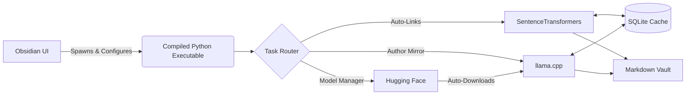

# PKM AI

Local, private AI orchestration for Personal Knowledge Management (PKM). 

This project bridges a local Python backend with an Obsidian frontend, allowing you to enrich your markdown vault using local Large Language Models (LLMs) and vector embeddings ; entirely offline and without subscription APIs.

## Features

- **Zero-Setup Standalone App:** The backend is compiled into a standalone executable for Windows and macOS. No Python environments, no Node.js, and no terminal commands are required for end-users.
- **Semantic Auto-Links:** Scans your vault, computes embeddings for each note using `sentence-transformers`, and automatically injects contextual wikilinks to conceptually similar notes.
- **Author Mirror (Thesis / Antithesis):** Uses a local LLM (via `llama.cpp`) to read a note and generate a dialectical response, proposing one real-world author who supports your idea and another who opposes it, complete with synthesized arguments.
- **Zero-Friction AI (Auto-Download):** No need to hunt for models. The backend will automatically download and cache a highly efficient, lightweight LLM (Qwen3.5-2B) from Hugging Face on its first run. Power users can easily toggle to use their own local `.gguf` files.
- **Obsidian Native Configuration:** Say goodbye to editing YAML files. The plugin features a comprehensive native settings menu inside Obsidian to control model paths, similarity thresholds, and ignored directories.
- **Live Status Polling:** Features a dynamic UI progress tracker in the Obsidian status bar so you always know what the background engine is processing.
- **Smart Caching:** Uses SQLite to cache document hashes and high-dimensional vectors, ensuring that AI models only process notes that have actually been modified.

## Architecture



## Installation (For Users)

**No programming experience required. The app comes pre-packaged.**

- Go to the [Releases page](https://github.com/maeldepreville/pkmai/releases) of this repository.
- Download the latest `.zip` file for your operating system (`pkmai-windows.zip` or `pkmai-macos.zip`).
- Extract the downloaded file. You will get a folder named `pkmai-bridge`.
- Move the `pkmai-bridge` folder into your vault's hidden plugins directory: `/path/to/your/vault/.obsidian/plugins/`
- Restart Obsidian, go to **Settings > Community Plugins**, and turn on **PKM AI Bridge**.

## Installation (For Developers)

If you want to modify the code or build from source, you will need **Python 3.10+** (via [uv](https://github.com/astral-sh/uv)) and **Node.js**.

**1. Build the Backend**

Clone the repository and install the backend as an editable package using `uv`:

```bash
git clone https://github.com/maeldepreville/pkmai.git
cd pkmai
pip install uv
uv sync
```

**2. Build the Frontend Bridge**

Navigate to the plugin directory and compile the TypeScript:

```bash
cd pkmai-bridge
npm install
npm run build
```

## Usage

### Inside Obsidian (Automated)

Once the plugin is installed and enabled, the TypeScript bridge will **automatically launch the background AI server** whenever Obsidian opens, and safely shut it down when Obsidian closes.

- Open the PKM AI settings in Obsidian to set your Vault Path and toggle your preferred AI model.
- Click the link or user icons in the Obsidian sidebar to trigger the respective background processes.
- Watch the bottom-right status bar for live polling updates (e.g., Downloading Model... ➔ Generating... ➔ Complete!).

### The CLI (For Developers)

The project includes a fully featured Typer CLI. If you are developing from source, you can run tasks manually from the terminal using your `config.yaml` file:

```bash
pkmai info          # View current system configuration
pkmai links         # Run the Auto-Links pipeline manually
pkmai mirror        # Run the Author Mirror pipeline manually
pkmai mirror -f     # Force regenerate mirrors, bypassing the cache
```

## Technical Stack

- **AI/ML:** `llama-cpp-python`, `sentence-transformers`, `huggingface_hub`, `numpy`
- **Backend:** `FastAPI`, `uvicorn`, `typer`, `pydantic`
- **Data:** Standard `sqlite3` (Vector binary serialization)
- **Frontend:** TypeScript, Obsidian API
- **Distribution:** `PyInstaller`, GitHub Actions CI/CD